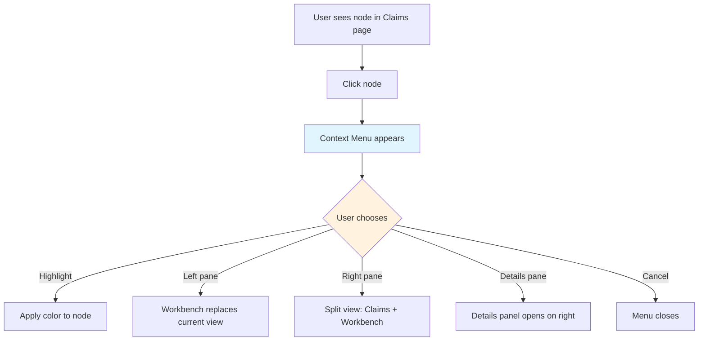
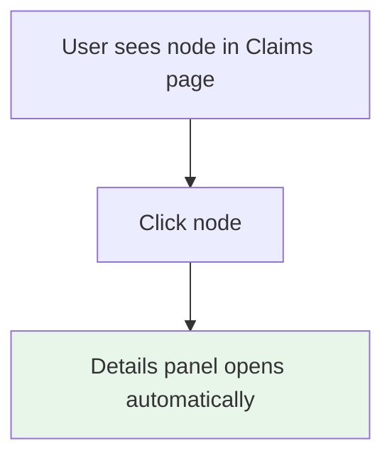
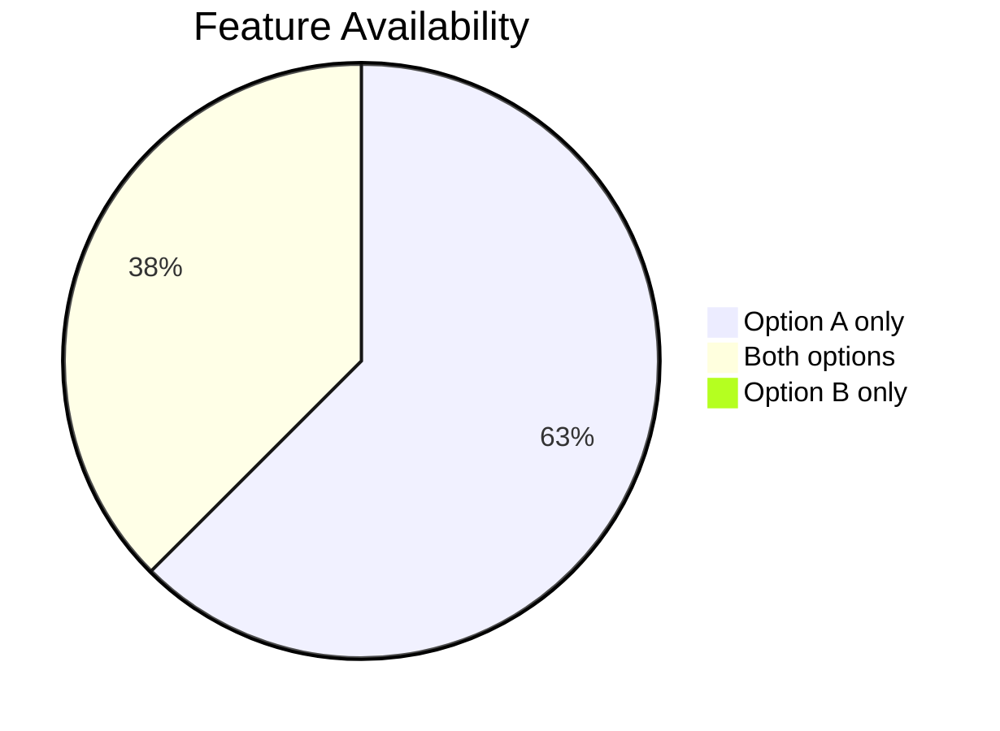
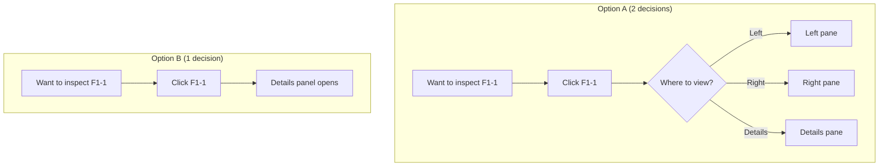
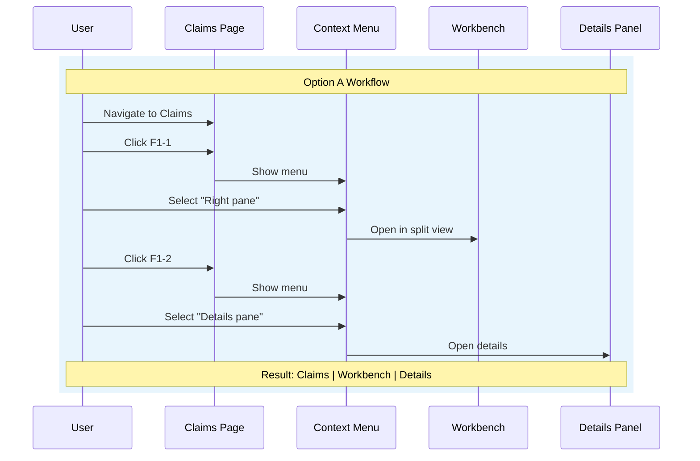
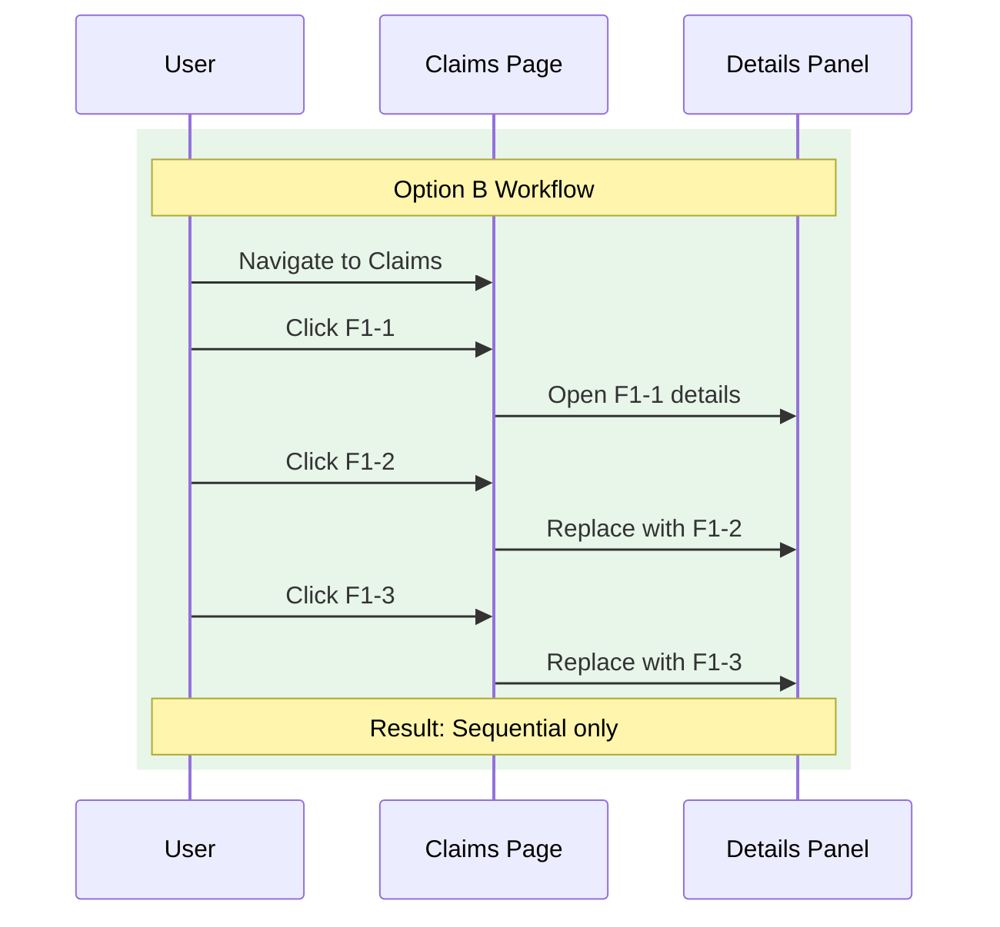
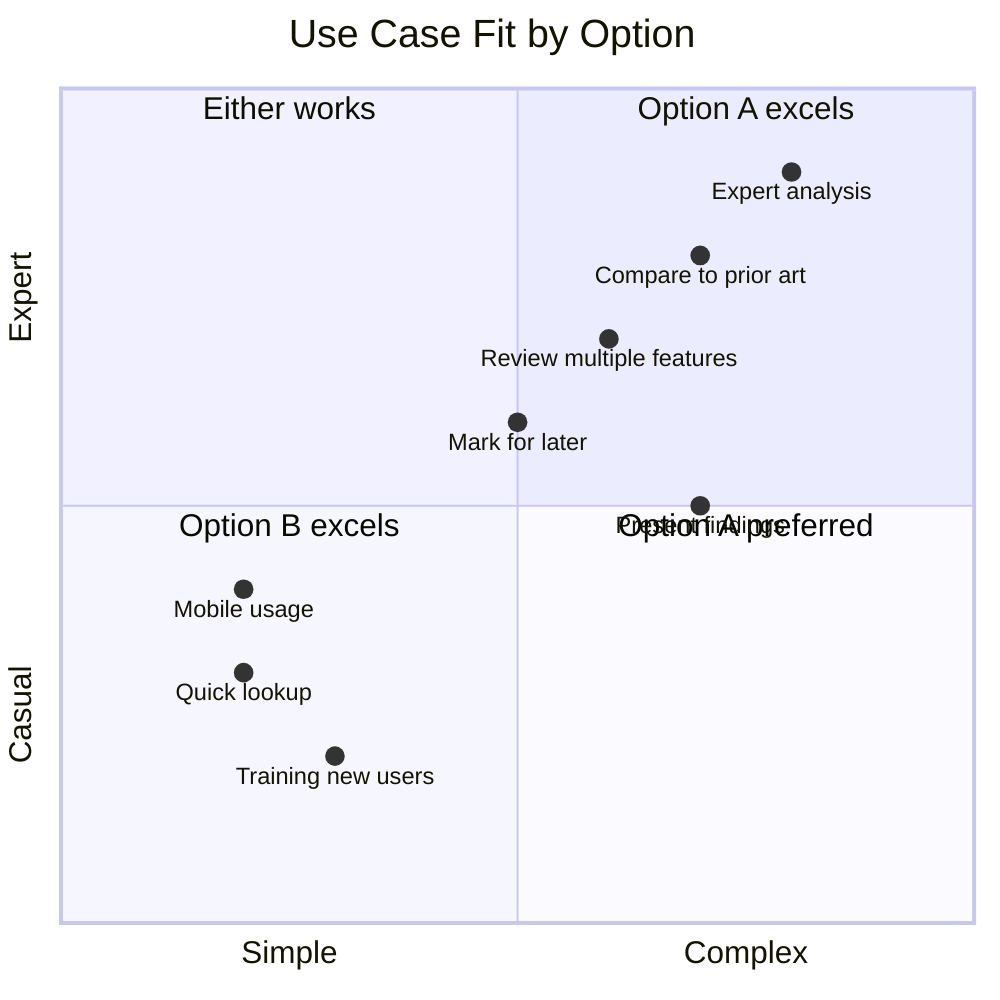
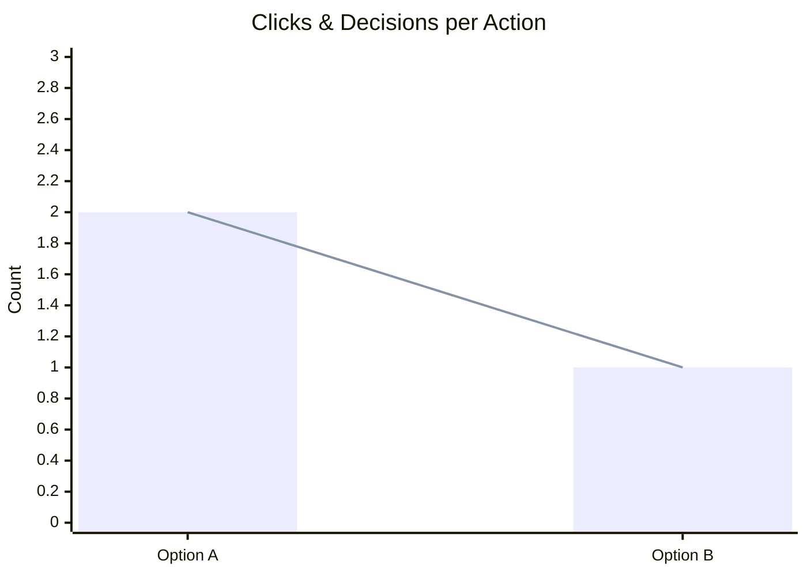
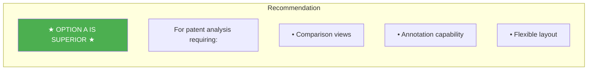

# Interaction Mode Analysis: Option A vs Option B

## User Journey Flows

### Option A: Contextual Menu Flow

### Option B: System Routed Flow

## Feature Comparison

| Feature | Option A | Option B |
|---------|:--------:|:--------:|
| Click-to-details | ✓ | ✓ |
| Highlight text (5 colors) | ✓ | ✗ |
| Clear highlights | ✓ | ✗ |
| View in left pane | ✓ | ✗ |
| View in right pane (split) | ✓ | ✗ |
| View in details pane | ✓ | ✓ |
| Access to Workbench page | ✓ | ✗ |
| Side-by-side comparison | ✓ | ✗ |
| Single-click to evidence | ✗ | ✓ |
| Predictable destination | ✗ | ✓ |

## Decision Tree Comparison

## Workflow Comparison: Review Claim 1

## Use Case Fit

## Cognitive Load

| Metric | Option A | Option B |
|--------|:--------:|:--------:|
| Decisions required | 2 | 1 |
| Clicks to evidence | 2 | 1 |
| Flexibility | HIGH | LOW |
| Learning curve | MEDIUM | LOW |

## Recommendation

### Why Option A Wins

1. **AI Reasoning Inspection** requires cross-referencing:
   - Claim text ↔ AI interpretation
   - Feature ↔ Prior art mapping
   - Multiple features ↔ Overall conclusion

2. **Highlighting** lets users mark agreement/disagreement

3. **Split view** enables simultaneous claim + evidence viewing

### Suggested Refinements for Option A

- Add keyboard shortcut: `D` for Details (most common action)
- Add "Remember my choice" user preference
- Make "Details pane" the first/default option
- Consider: single-click = details, right-click = full menu
